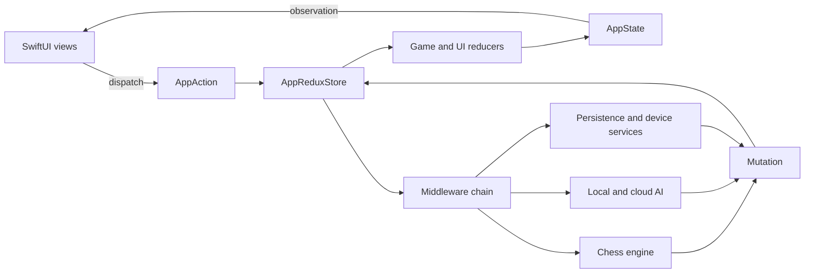

# SixFour - iOS Chess App

**SixFour** is a SwiftUI chess app for iOS with a local-first default flow.

> "64 squares, centuries of chess heritage."

## Key features

- Player vs AI gameplay with multiple difficulty levels.
- Local move generation and legal-move validation.
- In-game hinting and tactical suggestion.
- Local match history and replay.
- Standard chess rules: castling, en passant, promotion, check/checkmate, stalemate, repetition, 50-move rule.
- Optional NNUE/CoreML support for stronger evaluation.
- Accessibility-first flow with VoiceOver-aware announcements.

## Privacy

- Local-first experience by default.
- Consent-driven privacy module for analytics and crash reporting.
- SwiftData-based persistence.
- App-level privacy policy assets in `docs/`.

## App architecture

SixFour uses SwiftUI with a Redux-style, unidirectional state flow. The global
store is isolated to the `MainActor`, while expensive AI and storage work is
confined to dedicated actors under Swift 6 strict concurrency.



- **Presentation:** SwiftUI screens observe `AppReduxStore` and dispatch typed
  game or UI actions.
- **State management:** `AppState` contains the game and UI state. Reducers
  perform deterministic state transitions; middleware owns side effects.
- **Domain engine:** The chess engine handles legal moves, FEN, notation and all
  supported end-game rules independently from the views.
- **AI:** `RAGChessAI` combines iterative Negamax, an opening book and the
  bundled NNUE Core ML model, with a heuristic fallback. Master mode can use the
  optional Stockfish cloud provider.
- **Data and services:** SwiftData stores games locally. A lightweight dependency
  container supplies persistence, analytics, accessibility, audio and haptics.
- **Concurrency:** UI state stays on `MainActor`; AI, Core ML and SQLite resources
  are isolated behind actors and explicit Sendable boundaries.

## Source layout

```text
SixFourChess/SixFourChess/Sources/
  AI/              NNUE and AI helpers, opening book, move hints
  ConsentModule/   CMP and privacy settings
  DI/              Light dependency injection
  Engine/          Game engine, FEN handling, move parsing
  Models/          Domain models
  Redux/           Store, actions, reducers, middlewares, selectors
  Services/        Analytics, accessibility, audio, haptics
  Storage/         SwiftData snapshots and local game records
  Theme/           Design system
  Views/           SwiftUI screens and components
```

## Documentation

| Document | Description |
|---|---|
| [documentation/architecture/ARCHITECTURE.md](./documentation/architecture/ARCHITECTURE.md) | Current architecture overview |
| [docs/ARCHITECTURE.md](./docs/ARCHITECTURE.md) | Publishing and store-facing architecture notes |
| [documentation/ai/BOT_ARCHITECTURE.md](./documentation/ai/BOT_ARCHITECTURE.md) | AI architecture notes |
| [documentation/architecture/GAME_FLOWS_SPECIFICATION.md](./documentation/architecture/GAME_FLOWS_SPECIFICATION.md) | Gameplay flow specification |
| [documentation/architecture/APP_BEHAVIOR_AND_FLOWS.md](./documentation/architecture/APP_BEHAVIOR_AND_FLOWS.md) | Runtime behavior and key flows |
| [documentation/product/NOTATION_GUIDE.md](./documentation/product/NOTATION_GUIDE.md) | Move notation model |
| [documentation/product/SCREENSHOTS.md](./documentation/product/SCREENSHOTS.md) | App Store screenshot workflow |
| [documentation/quality/TECH_SKILL_REPORT.md](./documentation/quality/TECH_SKILL_REPORT.md) | Technical skill report |
| [documentation/quality/ARCHITECTURE_LESSONS_MEMORY_AND_STATE.md](./documentation/quality/ARCHITECTURE_LESSONS_MEMORY_AND_STATE.md) | Memory safety + state lessons |
| [documentation/accessibility/VOICEOVER_TIMING.md](./documentation/accessibility/VOICEOVER_TIMING.md) | VoiceOver timing guide |

## Open-source checklist

- `CODE_OF_CONDUCT.md` defines community behavior.
- `CONTRIBUTING.md` defines contribution workflow.
- `SECURITY.md` defines security disclosure process.

## License

[MIT](./LICENSE)

Third-party and asset records: [NOTICE](./NOTICE), [third-party notices](./THIRD_PARTY_NOTICES.md), [asset provenance](./ASSET_PROVENANCE.md), and [SBOM](./sbom.cdx.json).

## Support

Open an issue in GitHub for usage questions, contribution questions, or bug reports.
